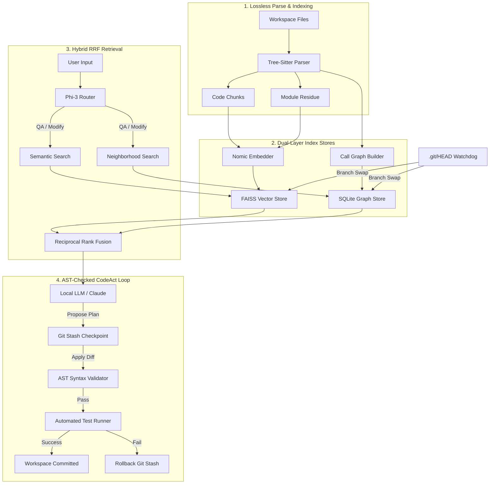

# AxonX Architecture

AxonX is a high-performance, local-first AI coding companion. Instead of relying on naive semantic search or sending entire repositories to the cloud, AxonX models your codebase as a **unified, branch-aware semantic-graph network** and executes modifications inside an **AST-validated safety sandbox**.

---

## 🗺️ System Overview

The following diagram illustrates how your codebase flows from raw files into the unified vector-graph index, and how the **CodeAct Agent** applies safe, validated edits to your workspace:

---

## ⚡ Core Technical Pillars

### 1. Dual-Layer Vector-Graph Indexing
Traditional AI assistants look at codebases as raw text files, which misses structural relationship maps. AxonX indexes codebases across two distinct planes:
* **Semantic Layer (FAISS):** Code is chunked into logical scopes (functions, classes, and methods) using a pinned **Tree-Sitter** parser. These chunks are embedded via `nomic-embed-text` into a CPU-optimized **FAISS** vector database (`IndexIDMap` wrapping `IndexFlatL2`).
* **Structural Layer (SQLite Call Graph):** Tree-Sitter extracts syntax entities and maps directed edges representing `CALLS` (functions calling other functions), `INHERITS` (class hierarchies), and `IMPORTS` (module dependencies) directly into a relational SQLite database.

### 2. Lossless Residue Parsing
Standard AST chunkers throw away lines of code that fall outside formal function or class definitions (such as global constants, package configurations, decorator definitions, and import headers). This starving of architectural information leads to LLM generation errors.
* AxonX maps all formal symbols and then automatically gathers all remaining **uncovered residue lines** into a specialized `module` chunk. This guarantees **100% of codebase content is preserved and searchable**.

### 3. Branch-Aware Delta Indexes
In modern development, switching git branches is a constant occurrence. 
* AxonX registers a filesystem watchdog on `.git/HEAD`. 
* When a developer switches branches (e.g. `git checkout feature`), the watcher immediately intercepts the event and loads a **branch-specific delta index store** in **less than 2 seconds**. 
* The base main-branch index is preserved, ensuring zero indexing latency and 100% search accuracy as you swap branches.

### 4. Reciprocal Rank Fusion (RRF) Retrieval
To combine the best of semantic search and structural relationships:
* The **RagAgent** queries both the semantic FAISS index and the SQLite call-graph.
* It merges the two ranked result lists using **Reciprocal Rank Fusion (RRF)**:
  $$\text{RRF\_Score}(d) = \sum_{m \in M} \frac{1}{k + r_m(d)}$$
  *(where $r_m(d)$ is the rank of document $d$ in system $m$, and $k \approx 60$)*.
* This guarantees that if a function matches semantically, its structural neighbor (the function that calls it) is automatically elevated into the LLM's context window, providing unmatched spatial awareness.

### 5. AST-Checked CodeAct Execution Loop
Writing broken code to disk is a catastrophic failure. The AxonX **CodeActAgent** wraps all modifications in a four-stage safety sandbox:
1. **Auto-Stashing:** Before any modifications are proposed, AxonX takes a git stash checkpoint of the current working state.
2. **Surgical Diff Planning:** Instead of rewriting entire files (which consumes massive token counts and leads to truncation), the agent generates a precise, JSON-structured string replacement replacement plan.
3. **AST Syntax Compiler Check:** Once the edits are drafted, the agent compiles the code using Python's Abstract Syntax Tree parser (`ast.parse`) or language-equivalent syntax validators. If there is a syntax error, the edit is aborted, and the LLM is prompted to self-correct *before* writing to disk.
4. **Automated Test Verification:** After a successful AST check, AxonX triggers your project's native test commands (`pytest`, `npm test`, `go test`). If the tests fail, AxonX rolls back the workspace to the initial git stash checkpoint automatically.
